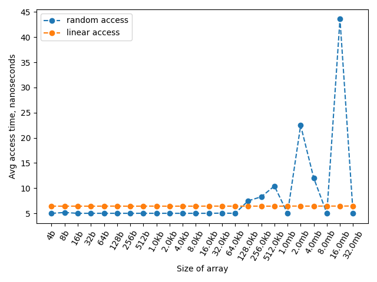
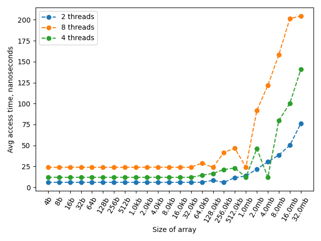

# Hpc Task №2
The tool for empirical measure of L1/L2/L3 cache levels, the cache line size and the influence of number of threads on the average access time.

## Prerequisites
* apt-get install build-essential
* python3
* matplotlib

## Usage
```sh
chmod +x *.sh
./run_cache_lines.sh
./run_cache_levels.sh
```

## Sample Output
The tests were proceeded on a clean virtual server with almost 0% load in idle, the output of lscpu is as follows: 
```
Model name:          Intel(R) Xeon(R) Platinum 8167M CPU @ 2.00GHz
Stepping:            4
CPU MHz:             1995.309
BogoMIPS:            3990.61
Virtualization:      VT-x
Hypervisor vendor:   KVM
Virtualization type: full
L1d cache:           32K
L1i cache:           32K
L2 cache:            4096K
L3 cache:            16384K
```

The output of cache_lines.cc is:
```
Size of step in bytes: 4, avg access time: 3.52925 nanoseconds
Size of step in bytes: 8, avg access time: 3.51646 nanoseconds
Size of step in bytes: 16, avg access time: 3.51855 nanoseconds
Size of step in bytes: 32, avg access time: 3.51876 nanoseconds
Size of step in bytes: 64, avg access time: 3.53418 nanoseconds
Size of step in bytes: 128, avg access time: 3.69324 nanoseconds
Size of step in bytes: 256, avg access time: 3.85245 nanoseconds
Size of step in bytes: 512, avg access time: 4.00505 nanoseconds
Size of step in bytes: 1024, avg access time: 4.35997 nanoseconds
```

The output images of cache_levels.cc are:


